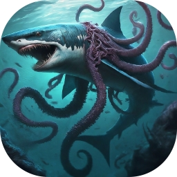

# jsharktopoda

A JavaFX-based video player for macOS, Linux, and Windows with a remote UDP control interface. It is part of MBARI's [VARS](https://github.com/mbari-org/vars-annotation) (Video Annotation and Reference System) ecosystem, allowing external applications to control video playback, seek, frame capture, and more.



## Features

- Open and play video files or URLs
- Remote control via UDP protocol — other applications can command playback, seek, and frame capture
- Multiple simultaneous video windows, each identified by UUID
- Frame capture (snapshot) to image files
- Configurable UDP port (default: 8800), persisted across sessions
- Cross-platform: macOS, Linux, Windows

## For Users

### Download

Pre-built application packages are available from the [Releases](https://github.com/mbari-org/jsharktopoda/releases) page. Each release includes a platform-native installer with a bundled JDK, so no separate Java installation is required.

### Usage

1. Launch jsharktopoda.
2. The toolbar provides buttons for:
   - **Power** — start/stop the UDP listener
   - **Settings** — configure the UDP port (default: 8800)
   - **Open File** — open a local video file
   - **Open URL** — open a video from a URL
3. External applications (e.g. [VARS Annotation](https://github.com/mbari-org/vars-annotation)) can send UDP commands to control playback.

### UDP Remote Protocol

The remote control protocol is documented in the [Sharktopoda Requirements](https://github.com/mbari-org/Sharktopoda/blob/main/Requirements/UDP_Remote_Protocol.md). A Java implementation of a remote control client is available in the [vcr4j-remote](https://github.com/mbari-org/vcr4j/tree/master/vcr4j-remote) module of [vcr4j](https://github.com/mbari-org/vcr4j).


## For Developers

### Prerequisites

- **Java 25** (e.g. [Eclipse Temurin](https://adoptium.net/))
- **Gradle 9.3.1** (included via the Gradle wrapper)

### Build

```bash
# Build the application
./gradlew clean build

# Run the application
./gradlew run

# Build a platform-native application package with bundled JDK
./gradlew clean jpackage --info
```

The packaged application is output to `build/jpackage/`.

### Tests

```bash
# Run all tests
./gradlew test

# Run a single test class
./gradlew test --tests "org.mbari.jsharktopoda.SanityCheck"
```

### Check for Dependency Updates

```bash
./gradlew dependencyUpdates
```

### Architecture

jsharktopoda is a Java module (`open module jsharktopoda`, defined in `src/main/java/module-info.java`).

#### Core Classes

| Class | Role |
|---|---|
| `JSharktopoda` | Main `Application` entry point. Creates the toolbar stage and manages the UDP listener (`VideoControl`) via vcr4j. |
| `SharkVideoController` | Implements vcr4j's `VideoController` interface — the bridge between remote UDP commands and JavaFX video players. Maintains a `Map<UUID, MovieStageController>`. |
| `MovieStageController` | Wraps a `MoviePaneController` in a JavaFX `Stage`. Handles window lifecycle and sizing. |
| `MoviePaneController` | FXML-backed controller for the video playback UI (play/pause, time scrubber, frame capture via `MediaView.snapshot()`). |

#### Command Flow

```
UDP command → vcr4j VideoControl → SharkVideoController → MovieStageController → MoviePaneController / MediaPlayer
```

#### Key Packages

- `org.mbari.jsharktopoda` — Core application and UI controllers
- `org.mbari.jsharktopoda.etc.javafx` — JavaFX utilities (FXML loading, timecode formatting, Material icons)
- `org.mbari.jsharktopoda.etc.vcr4j` — vcr4j adapter types (`SharkVideoController`, `FrameCaptureImpl`, `VideoInfoImpl`)
- `org.mbari.jsharktopoda.etc.jdk` — General utilities (`Preconditions`, `Images`)

#### Key Dependencies

- [vcr4j](https://github.com/mbari-org/vcr4j) (`vcr4j-core`, `vcr4j-remote`) — UDP remote control protocol
- [RxJava 3](https://github.com/ReactiveX/RxJava) — Reactive streams (used internally by vcr4j)
- [Ikonli](https://kordamp.org/ikonli/) — Material Design icons for JavaFX
- [jcommons](https://github.com/mbari-org/jcommons) — Image utility for frame captures

### macOS Code Signing and Notarization

```bash
export MAC_CODE_SIGNER=<your signing identity>

./gradlew clean jpackage --info

cd build/jpackage

ditto -c -k --keepParent "jsharktopoda.app" "jsharktopoda.zip"

xcrun notarytool submit "jsharktopoda.zip" \
    --wait \
    --team-id <your team id> \
    --apple-id <your apple dev account email> \
    --password <your app signing password>

xcrun stapler staple "jsharktopoda.app"

rm "jsharktopoda.zip"

ditto -c -k --keepParent "jsharktopoda.app" "jsharktopoda-$(git describe --tags)-mac-$(arch).zip"
```

The build automatically signs all runtime binaries and the app bundle using entitlements from `src/jpackage/macos/java.entitlements`.

## License

[Apache License 2.0](LICENSE)
