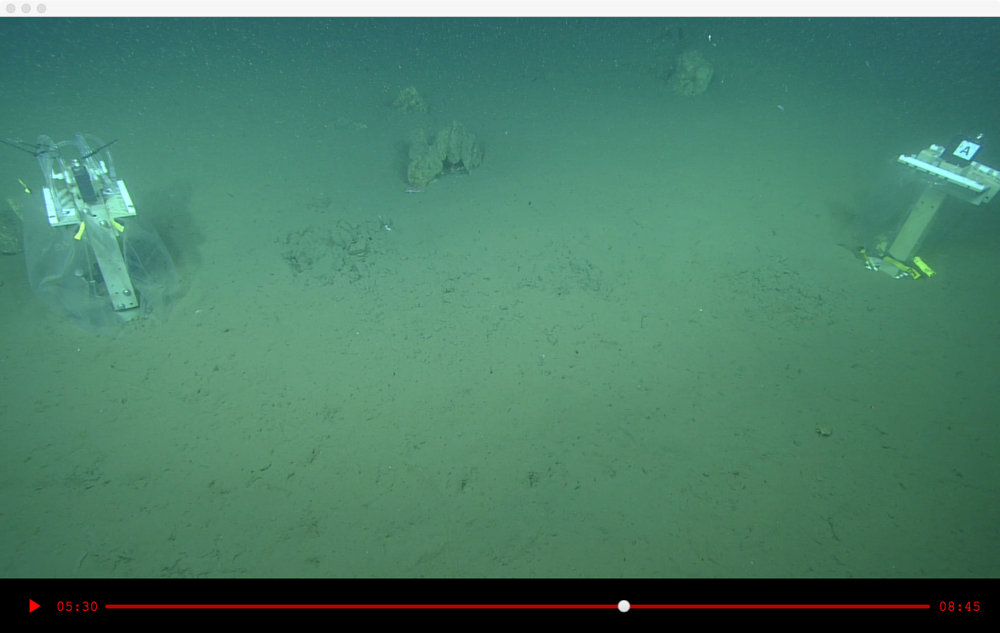

# jsharktopoda

JavaFX-based video player for macOS, Linux, and Windows. Provides remote UDP interface for integration with other apps. See [REQUIREMENTS.md](https://github.com/mbari-media-management/Sharktopoda/blob/main/docs/REQUIREMENTS.md) for the UDP remote interface specification.

A java implementation of a remote control is available in the [vcr4j-sharktopoda](https://github.com/mbari-media-management/vcr4j/tree/master/vcr4j-sharktopoda) module of [vcr4j](https://github.com/mbari-media-management/vcr4j)

## Screenshot

## Download

You can download JSharktopoda, as a Java jar, from [bintray](https://bintray.com/hohonuuli/generic/download_file?file_path=jsharktopoda-0.1.2-app.jar)
